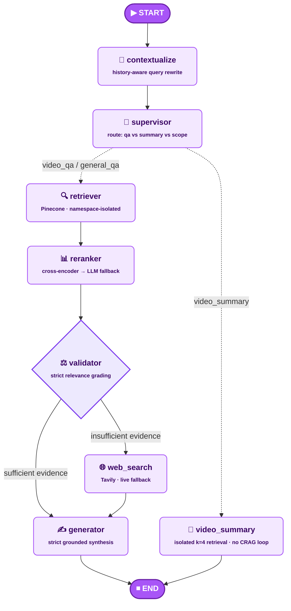

<!-- ============================================================ -->
<!-- REPLACE the "🧠 Agentic Workflow Architecture" and            -->
<!-- "⚡ Specialized AI & Pipeline Nodes" sections in README.md      -->
<!-- with everything below.                                        -->
<!-- ============================================================ -->

## 🧠 Agentic Workflow Architecture

The core graph is a **self-correcting evaluation loop** with a **history-aware
entry gate**: every query is first resolved against conversational memory,
then routed, retrieved, reranked, and strictly graded before generation —
falling back to live web search only when local evidence is insufficient.

> ⚠️ **Note on `video_summary`:** this node does **not** flow through the shared
> `retriever → reranker → validator → web_search` pipeline. It performs its own
> isolated Pinecone lookup (`k=4`, filtered by `video_id`) and generates
> directly — meaning the CRAG self-correction loop and anti-hallucination
> grading apply to the **Q&A path only**, not to summaries. This is a
> deliberate scope trade-off, not a missing feature.

---

## ⚡ Specialized AI & Pipeline Nodes

### 🧠 0. Contextualize / Query-Rewrite Node — *conversational memory*
The entry point of the graph. Pulls the last `N` turns of chat history
(persisted in Supabase, injected fresh on every request — no in-memory state)
and resolves the raw user message into a fully standalone question before
anything else runs. Guards explicitly against two failure modes: (a) pronoun
drift ("explain that more" → resolved against the actual prior subject), and
(b) false-positive topic merging (a genuinely new, unrelated question is never
force-fitted into the previous topic). Every downstream node consumes this
resolved query, never the raw one.

### 🎯 1. Supervisor & Router Node
Determines the runtime path of the state graph using the **resolved** query.
Inspects `search_scope`, extracts user credentials, and dictates whether the
agent searches locally within a specific video boundary, globally across all
collections, or routes straight to structured summarization.

### 🔍 2. Pinecone Retriever Node
Performs sub-linear semantic queries on high-dimensional vectors stored in
Pinecone. Enforces absolute security separation by locking searches strictly
within the active user's namespace (`user_id`). Pulls a wider candidate pool
than it needs (`k=8` in multi-video scope) specifically so the reranker has
real signal to work with.

### 📊 3. Reranker Node — *noise filtering before grading*
Sits between retrieval and validation. Scores every candidate chunk against
the resolved query with a lightweight local cross-encoder
(`ms-marco-MiniLM-L-6-v2`), falling back automatically to an LLM-based scorer
if the cross-encoder isn't installed — never crashes the pipeline either way.
Trims the candidate pool down to the top-N most relevant chunks *before* the
validator ever sees them, reducing false "insufficient evidence" verdicts that
would otherwise trigger unnecessary web-search fallbacks.

### ⚖️ 4. Content Validator (Evaluator) Node
Acts as the anti-hallucination guardrail. Grades the reranked chunks against
the resolved query with a strict binary score. If the evidence is insufficient,
it flags the graph state and routes away from local context entirely — no
partial/blended answers.

### 🌐 5. Tavily Web Search Fallback Node
When local video assets fail validation, this node triggers a live web search
via the **Tavily API Engine**, wrapped in exponential-backoff retry for
transient network failures. Feeds clean contextual facts back into the
generator state and flags the response as web-sourced for transparency.

### ✍️ 6. Generator Node — *strict grounded synthesis*
Synthesizes the final response using **only** the provided context (video
chunks or web results), citing video timestamps inline as `[MM:SS]` and
structuring every distinct source into a typed `sources[]` array the frontend
renders directly — never trusting the LLM's own claimed `video_id`/`start_time`
over what was actually retrieved.

### 📝 7. Video Summary Node — *isolated, non-corrective path*
Generates a structured, chronological academic summary directly from its own
`k=4` Pinecone lookup (see note above) — bypassing reranking, validation, and
web fallback entirely. Optimized for broad narrative coverage rather than
pinpoint query relevance.
